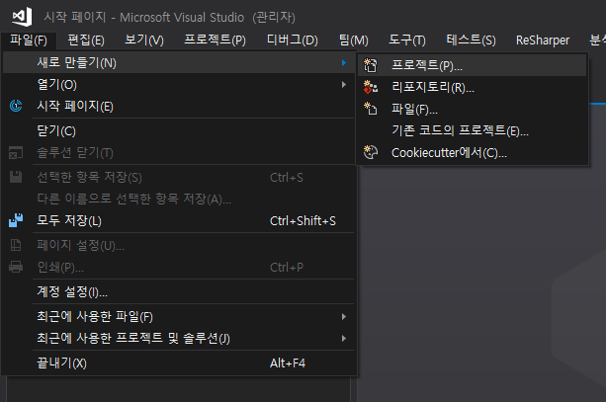
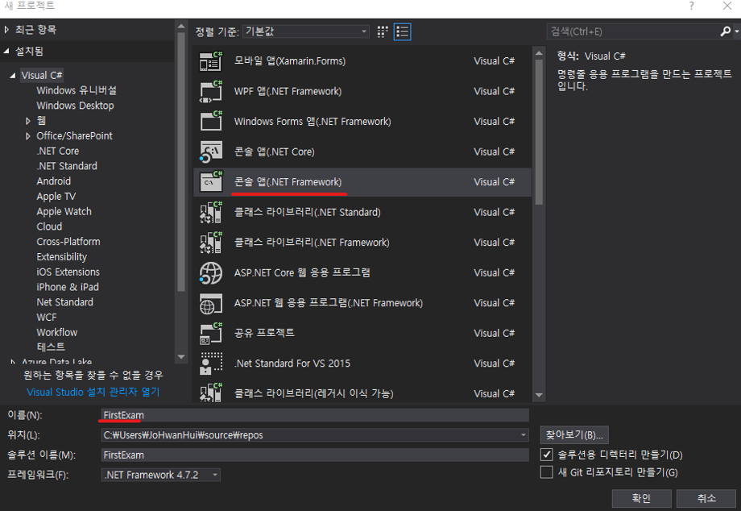
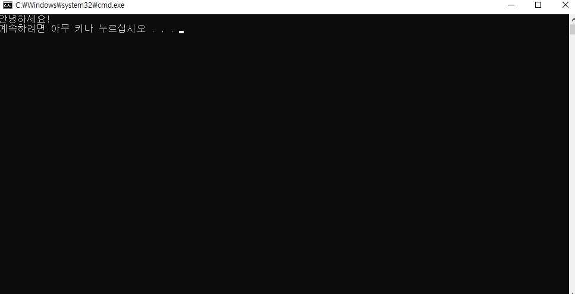

## 개요
1. 일자 : 2019. 02. 15 (목) 13:00 ~ 16:00
2. 장소 : 신촌 윙스터디

## 수업내용
### 프로그래밍 언어 개념, C#으로 맛보기

#### 1. 프로그래밍 언어란 무엇인가?

 사람들은 말을 통해 서로 대화를 하고 서로의 생각을 주고 받습니다. 그렇다면 사람과 컴퓨터는 어떻게 대화를 할까요? 어떤 사람들들은 마우스와 키보드를 통해서 인터넷을 켜고, 게임을 하는 반면 또 어떤 사람들은, 이상한 명령어들을 이용해서 그러한 인터넷이나 게임을 만들기도 합니다. 그 이상한 명령어를 ​프로그래밍 언어라고 부릅니다.

 사람들간에는 한국어, 영어, 프랑스어 등이 있듯이, 프로그래밍 언어에도 여러 종류가 있습니다. C, C++, C#, JAVA, PYTHON, 등으로 불리고 있습니다.

 그리고 이 수업에서는 위에서 언급한 C#이라고 하는 프로그래밍 언어로 프로그램을 만들어 보도록 하겠습니다.

#### 2. 프로그램 만들어보기

- Visual Studio 2015를 켠 후 파일 -> 새로만들기 -> 프로젝트를 선택합니다.  

- 좌측 템플릿에서 Visual C# -> 콘솔 응용프로그램을 선택합니다.  

- 이름은 간단하게 FirstExam 으로 해봅시다.  

- 화면에 내용을 출력하는 코드를 작성해볼게요!

```C#
using System;

namespace FirstExam
{
    class Program
    {
        static void Main(string[] args)
        {
            Console.Out.WriteLine("안녕하세요!");
        }
    }
}
```

- 어때요? 참 쉽죠??

- ctrl + F5를 눌러서 실행해봅시다!

---
#### 2. 변수에 대한 개념 익히기
---
 간단하게 예를 들어서 설명 드릴게요! 인터넷 쇼핑을 하다보면 사고 싶은 물건들은 '장바구니'에 담아두지요? 이와 비슷하다고 생각하시면 됩니다. '장바구니'는 <쇼핑몰 서버 컴퓨터>의 메모리 어느 곳에 'OOO님의 장바구니' 라는 이름으로 메모리를 담을 수 있는 공간이 생성되고 
그 공간에 'OOO님의 장바구니 목록'이라는 물건들의 데이터가 담겨집니다. 우리는 데이터를 확인하기만 하면 되는거구요.  

C#에서는 위와 비슷한 상황에서 '변수'라는걸 사용합니다. 
  - 저장소의 어느 한 지점에 데이터를 담을 수 있는 '공간'을 생성하고 (객체)
  - 그 공간의 이름을 지정해 줄수가 있습니다. (식별자)
  - 이 때 그 공간에 담을 수 있는 데이터들의 '형태'를 지정할 수 있는데, 이를 타입이라 합니다.

이게 다 무슨소리냐구요? 잘 이해가 안되도 좋습니다. (우리는 입문단계니까요) 예제를 통해 쉽게 배워봅시다.

```C#
using System;

namespace FirstExam
{
    class Program
    {
        static void Main(string[] args)
        {
            int myNumber;
            myNumber = 9;

            Console.Out.WriteLine("내가 가장 좋아하는 숫자 ");
            Console.Out.WriteLine(myNumber);
        }
    }
}
```

##### 분석

int myNumber; 이 부분이 변수의 선언 입니다. (사용하고 싶은 변수를 말해준다. 라고 생각하면 됩니다.) myNumber은 변수의 이름(식별자)이 됩니다.int 는 객체 myNumber 가 담을 수 있는 타입이 됩니다. int라고 적게되면 정수형태만 담을 수 있게 됩니다. myNumber = 10; 은 myNumber라고 하는 객체에 정수 10을 담아라. 라는 의미입니다.
' = '를 통해서 변수에 값을 담을 수 있게 됩니다.

이제 변수를 출력해 볼 차례네요!

```C#
// int형 타입의 변수를 myNumber의 내용을 가져와 출력해주는 겁니다.
Console.Out.WriteLine(myNumber); 
```
---
#### 3. if문 배우기
---

이번엔 조건문! if를 배워보도록 해보아요. 조건문이 뭐다냐?? 말 그대로 조건을 다는 겁니다. 예를들어, 새해가 되면 모두 새해 계획을 세우곤 하죠? 운동을 한다, 토익을 한다.. 등등 (저도 참 계획만..ㅠㅠ) 
이를 조건문으로 나타내봅시다!

올해가 2019년이라면? 나는 운동을 할것이다.

```C#
//'=' 기호가 두번 사용 되는걸 눈 여겨 보세요!
if ( nowYear == 2019 ) {
    Console.Out.WriteLine(" 새해가 됐으니 나는 운동을 할것이야 ");
}
```

이런식으로 나타낼 수 있습니다:) 개념적인 부분은 이렇고 간단한 계산기를 만들어 보도록 할게요! 

```C#
using System;

namespace FirstExam
{
    class Program
    {
        static void Main(string[] args)
        {
            string x = Console.In.ReadLine();
            string op = Console.In.ReadLine();
            string y = Console.In.ReadLine();

            int numberX = int.Parse(x);
            int numberY = int.Parse(y);

            int result = 0;
            if (op == "+")
            {
                result = numberX + numberY;
            }
            if (op == "-")
            {
                result = numberX - numberY;
            }
            if (op == "*")
            {
                result = numberX * numberY;
            }
            if (op == "/")
            {
                result = numberX / numberY;
            }

            Console.Out.WriteLine(result);
        }
    }
}
```

##### 분석

Console.In.ReadLine()은 키보드로부터 값을 입력받게 해주는 명령어(함수) 입니다. 입력 받은 문자열을 x에 대입하고 있네요.
```C#
string x = Console.In.ReadLine();
```


그리고 우리는 숫자를 덧셈 해야하기 때문에, 문자열을 숫자로 변경 시켜줄것입니다. 이때 사용하는 명령어(함수)는 int.Parse라고 하는 명령어(함수) 입니다!
```C#
int numberX = int.Parse(x);
```

나머지 부분은 직접 분석해보세요!

---
#### 4. 반복문! for문 익히기
---

 반복문을 배워보도록 합시다. 특정 구문을 반복해서 수행하는걸 반복문이라 한답니다. 예를들어, "철수야!! 라고 10번 출력해라" 라고 하는 프로그램을 만들 때 쓰이는 거죠.

```C#
for (int i = 0; i < 10; i++) {
    printf("철수야!!");
}
```
이런식으로 쓰인답니다.  
구조는 어떤 형식이냐면, 우선 세미콜론(;)으로 세 기준을 나눕니다.  
for ( 초기값 ; 조건 ; 연산 ) 이런식으로 말이죠.  

초기값이란 : 반복에 사용될 변수의 초기값을 의미합니다. i = 0; 이런식으로 말이죠.  
조건이란 : 이 조건이 참이면 반복을 진행하고, 거짓이면 반복을 멈춥니다.  
연산이란 : 반복에 사용될 변수가 어떻게 변하는지 작성합니다. 보통 증가하거나 감소하는 연산을 적어줍니다.  

그럼 다시 위의 코드를 봤을 때  
1. 변수 i 가 있고 0부터 시작하며
2. i가 10보다 작을 시
3. 철수야!!를 출력한다.
4. 그리고나서 i는 1증가한다. (i++)

이와 같이 읽으면 된답니다.

어때요? 간단하죠?

직접 코드를 따라 작성해보세요^^
 
---
#### 5. 배열 익히기
---
 이번엔 배열을 배워볼 거에요!  배열은 수학에서 집합의 개념과 비슷해요! 수에선 U = { 1, 2, ,3, 4  } 이런식으로 표현을 하지요? 이는 원소 1 , 2, 3, ,4가 U에 속해있는 집합입니다. 이런 집합을 c에서도 사용할수가 있는데요~ 한번 알아봅시다!!

배열은 두가지 방법으로 사용할 수 있어요!

첫 번째 방법
```C#
int[] x = new int[5];
x[0] = 1;
x[1] = 2;
x[2] = 3;
x[3] = 4;
x[4] = 5;
```

두 번째 방법
```C#
int[] x = {1, 2, 3, 4, 5};
```

두 번째 방법은 위의 첫번째 방법의 축약형 입니다!!

위 구문을 보시면 유추해볼 수 있는게,
1) 일반 변수랑 사용하는게 비슷하구나!
2) [] 이라는 첨자를 사용하는구나!
3) {}; 으로 원소를 정의하는구나!

※ 만약 배열이 없었다면 x1, x2, x3, x4 이런식으로 만들어야겠죠?

---
## 수업 피드백
- 주 2회 수업으로 결정, 매주 화, 목 13:00~16:00
- 장소 변경 신촌 -> 약수역
---
## 참고 자료
- http://www.csharpstudy.com/CSharp/CSharp-Intro.aspx
