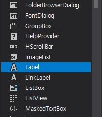

__1. 계산기 프로젝트를 만듭니다.__  


__2. 왼쪽의 도구상자에서 Button을 끌어다 놓습니다.__  


__3. 버튼의 Text를 1 ~ 9 까지 적어줍니다.__  


__4. 버튼의 name을 number1 ~ number9 까지 적어줍니다.__  


__5. 예쁘게 배열된 모습__  


__6. 이번엔 Label을 추가해봅니다.__  



__7. 이번엔 Label의 name과 Text를 변경해줍니다.__  

구분| name | Text
---- | ---- | ----
label1 | leftValue | ""
label2 | operation | "+"
label3 | rightValue | ""
label4 | result | "0"
  


__8. 디자인이 다 끝났으면, 각 버튼들을 더블클릭하여 이벤트 처리 함수를 만들어봅시다.__

```C#
private void number1_Click(object sender, EventArgs e)
{

}

private void number2_Click(object sender, EventArgs e)
{

}

private void number3_Click(object sender, EventArgs e)
{

}

private void number4_Click(object sender, EventArgs e)
{

}

private void numsber5_Click(object sender, EventArgs e)
{

}

private void number6_Click(object sender, EventArgs e)
{

}

private void number7_Click(object sender, EventArgs e)
{

}

private void number8_Click(object sender, EventArgs e)
{

}

private void number9_Click(object sender, EventArgs e)
{

}

private void plus_Click(object sender, EventArgs e)
{

}

private void minus_Click(object sender, EventArgs e)
{

}

private void divide_Click(object sender, EventArgs e)
{

}

private void multiple_Click(object sender, EventArgs e)
{

}

private void calculate_Click(object sender, EventArgs e)
{

}
```


__9. number1 ~ 3 이벤트 처리 함수에 다음과 같이 적어주고 실행해봅시다.__

```C#
private void number1_Click(object sender, EventArgs e)
{
	leftValue.Text = "1";
}

private void number2_Click(object sender, EventArgs e)
{
	leftValue.Text = "2";
}

private void number3_Click(object sender, EventArgs e)
{
	leftValue.Text = "3";
}
```

__10. 1을 클릭해봅시다.__


__11. Plus 처리도 같이 해줍시다.__


```C#

private void plus_Click(object sender, EventArgs e)
{
    operation.Text = "+"
}

```

__12. 이제 오른쪽에도 값을 넣을 수 있도록 만들어 줍시다.__


```C#
public partial class Form1 : Form
{
	private bool isOperationPushed = false;

	public Form1()
	{
		InitializeComponent();
	}

	( -- 중략 -- )

	private void plus_Click(object sender, EventArgs e)
	{
		operation.Text = "+";
	}

}
```

```C#

private void plus_Click(object sender, EventArgs e)
{
    operation.Text = "+";
    isOperationPushed = true;
}

```

```C#
private void number1_Click(object sender, EventArgs e)
{
    if (isOperationPushed == false)
    {
		leftValue.Text = "1";
    }

    if (isOperationPushed == true)
    {
		rightValue.Text = "1";
    }
}

private void number2_Click(object sender, EventArgs e)
{
    if (isOperationPushed == false)
    {
		leftValue.Text = "2";
    }

    if (isOperationPushed == true)
    {
		rightValue.Text = "2";
    }
}

private void number3_Click(object sender, EventArgs e)
{
    if (isOperationPushed == false)
    {
		leftValue.Text = "3";
    }

    if (isOperationPushed == true)
    {
		rightValue.Text = "3";
    }
}

```

__13. 1, + 3을 눌러봅시다.__


__정상 동작이 된다면, 이제 계산 버튼에 기능을 추가해 봅시다.__


```C#
private void calculate_Click(object sender, EventArgs e)
{
    int leftNumber = int.Parse(leftValue.Text);
    int rightNumber = int.Parse(rightValue.Text);

    result.Text = (leftNumber + rightNumber).ToString();
}

private void number1_Click(object sender, EventArgs e)
{
    if (isOperationPushed == false)
    {
		leftValue.Text = leftValue.Text + "1";
    }

    if (isOperationPushed == true)
    {
		rightValue.Text = rightValue.Text + "1";
    }
}

private void number2_Click(object sender, EventArgs e)
{
    if (isOperationPushed == false)
    {
		leftValue.Text = leftValue.Text + "2";
    }

    if (isOperationPushed == true)
    {
		rightValue.Text = rightValue.Text + "2";
    }
}

private void number3_Click(object sender, EventArgs e)
{
    if (isOperationPushed == false)
    {
		leftValue.Text = leftValue.Text + "3";
    }

    if (isOperationPushed == true)
    {
		rightValue.Text = rightValue.Text + "3";
    }
}
```

__14. 111 + 333 = 을 눌러봅시다.__


__15. 정상적으로 동작된다면, 나머지 소스코드도 작성해줍시다.__


```C#
private void plus_Click(object sender, EventArgs e)
{
    operation.Text = "+";
    isOperationPushed = true;
}

private void minus_Click(object sender, EventArgs e)
{
    operation.Text = "-";
    isOperationPushed = true;
}

private void divide_Click(object sender, EventArgs e)
{
    operation.Text = "/";
    isOperationPushed = true;
}

private void multiple_Click(object sender, EventArgs e)
{
    operation.Text = "*";
    isOperationPushed = true;
}

private void calculate_Click(object sender, EventArgs e)
{
    int leftNumber = int.Parse(leftValue.Text);
    int rightNumber = int.Parse(rightValue.Text);

    if (operation.Text == "+")
    {
		result.Text = (leftNumber + rightNumber).ToString();
    }
    else if (operation.Text == "-")
    {
		result.Text = (leftNumber - rightNumber).ToString();
    }
    else if (operation.Text == "*")
    {
		result.Text = (leftNumber * rightNumber).ToString();
    }
    else if (operation.Text == "/")
    {
		result.Text = (leftNumber / rightNumber).ToString();
    }
}
```