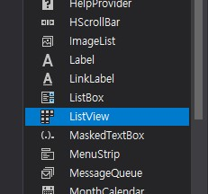
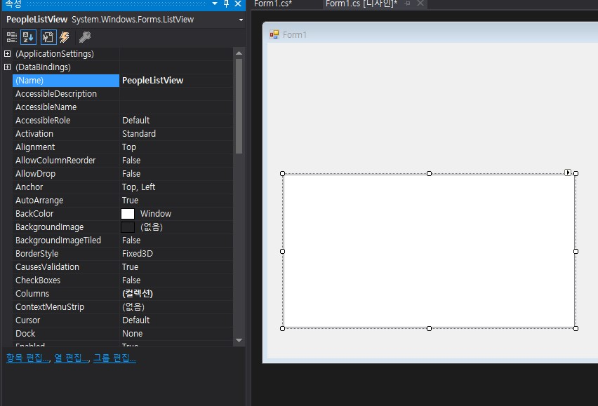
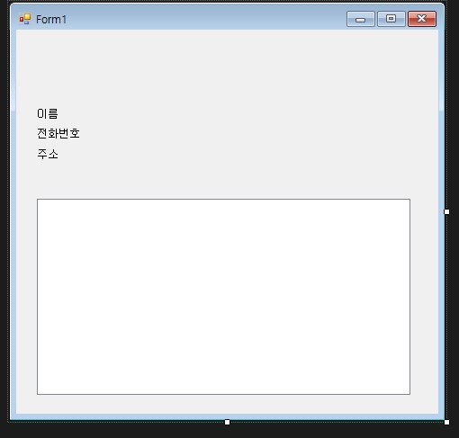
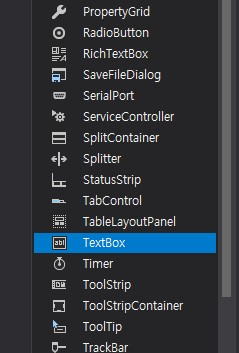
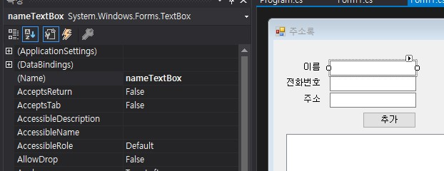
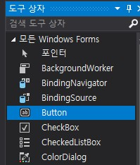
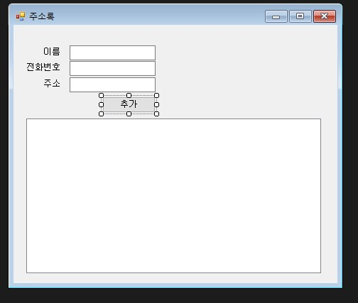
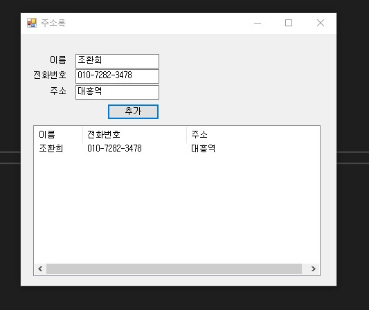
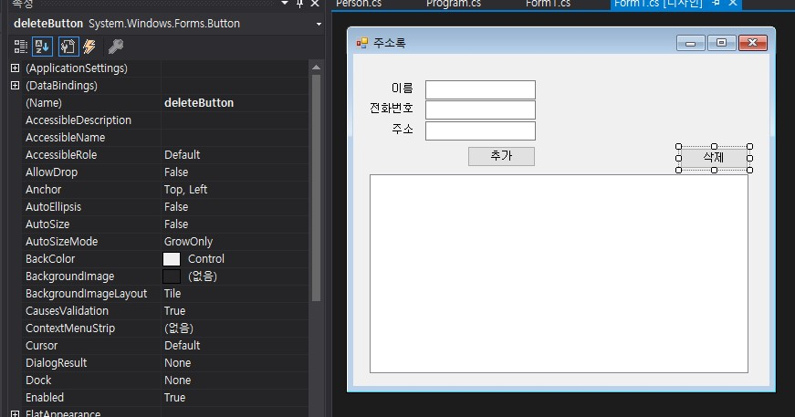

# 주소록 만들기

1. 주소록이라는 솔루션을 만들어 줍시다! 지난 시간에 했던거니 문제 없이 만들 수있겠죠?

2. 왼쪽 도구상자에서 ListView를 드래그 앤 드랍하여 추가해줍니다. ListView의 Name을 PeopleListView로 설정해줍시다!!  



3. 동일한 방법으로 Label도 드래그 앤 드랍하여 예쁘게 배열해줍니다.  


4. 동일한 방법으로 TextBox를 드래그 앤 드랍하여 예쁘게 배열해줍니다. 이는 유저로부터 데이터를 입력 받을 곳 입니다.  
각 TextBox의 Name을 순서대로, nameTextBox, phoneNumberTextBox, addressTextBox로 지정해줍시다.  



5. 이제 버튼을 추가해줍니다. 이 버튼을 누르면, 텍스트 박스의 데이터를 리스트뷰에 연결할 거예요! name을 add로 지정해주고, Text를 "추가"라고 지정해줍니다.  




6. Form을 더블클릭하여 아래와 같이 작성해줍니다.
```C#
    public partial class Form1 : Form
    {
        public Form1()
        {
            InitializeComponent();
        }

        private void Form1_Load(object sender, EventArgs e)
        {
            PeopleListView.View = View.Details;

            PeopleListView.Columns.Add("이름", 70, HorizontalAlignment.Left);
            PeopleListView.Columns.Add("전화번호", 150, HorizontalAlignment.Left);
            PeopleListView.Columns.Add("주소", 200, HorizontalAlignment.Left);
        }
    }
```

7. 추가 버튼도 더블클릭하여 아래와 같이 작성해줍니다.
```C#
        private void addButton_Click(object sender, EventArgs e)
        {
            PeopleListView.BeginUpdate();

            string name = nameTextBox.Text;
            string phoneNumber = phoneNumberTextBox.Text;
            string address = addressTextBox.Text;

            ListViewItem person = new ListViewItem(name);
            person.SubItems.Add(phoneNumber);
            person.SubItems.Add(address);
            PeopleListView.Items.Add(person);

            PeopleListView.EndUpdate();
        }
```

8. 빌드(ctrl+shift+b)를 해보고 실행(ctrl+f5)을 해봅니다.  


9. 위가 정상동작 된다면, 이제 "삭제" 기능을 만들어 보도록 합시다. Button을 추가하고, Text를 "삭제", Name을 deleteButton 으로 지정해줍니다.  


10. 삭제 버튼을 더블 클릭한 후 다음과 같이 작성해줍시다.

```C#
        private void deleteButton_Click(object sender, EventArgs e)
        {
            PeopleListView.BeginUpdate();

            int index = PeopleListView.FocusedItem.Index;
            PeopleListView.Items.RemoveAt(index);

            PeopleListView.EndUpdate();
        }
```
