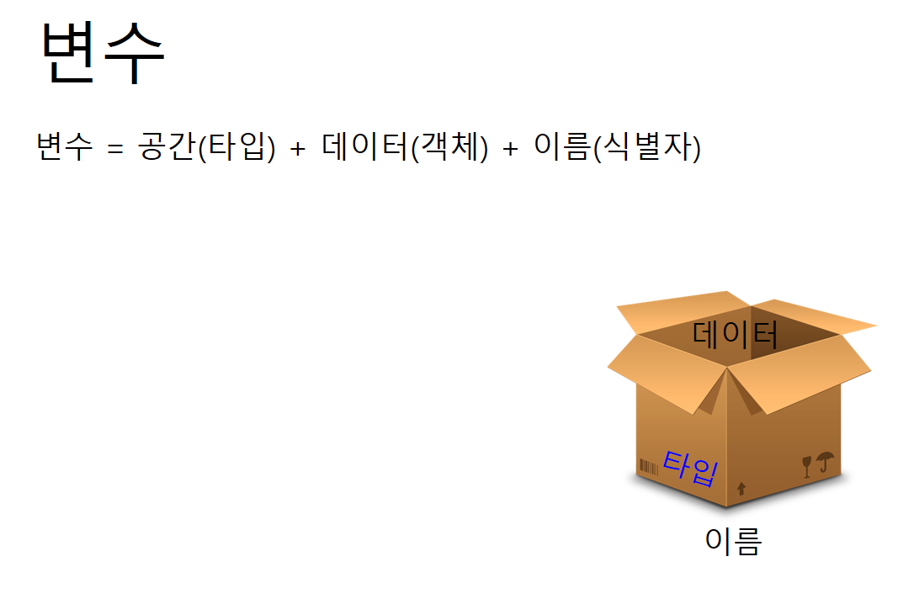
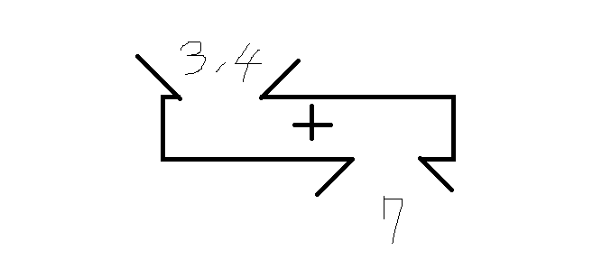

## 개요
1. 일자 : 2019. 03. 04 (월) 12:00 ~ 15:00
2. 장소 : 신촌 윙스터디

## 프로그래밍 언어란 무엇인가?

 사람들은 말을 통해 서로 대화를 하고 서로의 생각을 주고 받습니다. 그렇다면 사람과 컴퓨터는 어떻게 대화를 할까요? 어떤 사람들들은 마우스와 키보드를 통해서 인터넷을 켜고, 게임을 하는 반면 또 어떤 사람들은, 이상한 명령어들을 이용해서 그러한 인터넷이나 게임을 만들기도 합니다. 그 이상한 명령어를 ​프로그래밍 언어라고 부릅니다.

 사람들간에는 한국어, 영어, 프랑스어 등이 있듯이, 프로그래밍 언어에도 여러 종류가 있습니다. C, C++, C#, JAVA, PYTHON, 등으로 불리고 있습니다.

 그리고 이 수업에서는 위에서 언급한 C++이라는 프로그래밍 언어로 프로그램을 만들어 보도록 하겠습니다.

## 프로그램 만들어보기

- Visual Studio 2017을 켠 후 파일 -> 새로만들기 -> 프로젝트를 선택합니다.  
- 좌측 템플릿에서 Visual C++ -> 빈 프로젝트를 선택합니다.  
- 이름은 간단하게 FirstExam 으로 해봅시다.  
- 화면에 내용을 출력하는 코드를 작성해볼게요!

```C++
#include <cstdio> 
 
int main(void) {
    
    printf("Hello World! \n");
 
    return 0;
}
```

- 어때요? 참 쉽죠??

- ctrl + F5를 눌러서 실행해봅시다!


## 변수, 객체, 식별자

 간단하게 예를 들어서 설명 드릴게요! 인터넷 쇼핑을 하다보면 사고 싶은 물건들은 '장바구니'에 담아두지요? 이와 비슷하다고 생각하시면 됩니다. '장바구니'는 <쇼핑몰 서버 컴퓨터>의 메모리 어느 곳에 'OOO님의 장바구니' 라는 이름으로 메모리를 담을 수 있는 공간이 생성되고 
그 공간에 'OOO님의 장바구니 목록'이라는 물건들의 데이터가 담겨집니다. 우리는 데이터를 확인하기만 하면 되는거구요.  

C++에서는 위와 비슷한 상황에서 '변수'라는걸 사용합니다. 
  - 저장소의 어느 한 지점에 데이터를 담을 수 있는 '공간'을 생성하고 (객체)
  - 그 공간의 이름을 지정해 줄수가 있습니다. (식별자)
  - 이 때 그 공간에 담을 수 있는 데이터들의 '형태'를 지정할 수 있는데, 이를 타입이라 합니다.


  
이게 다 무슨소리냐구요? 이해가 안 되도 좋습니다. (우리는 입문단계니까요) 예제를 통해 쉽게 배워봅시다.

```C++
#include <cstdio>
 
int main (int argc, char* argv[]) {
    
    int myNumber;
    myNumber = 10;
    printf("내가 가장 좋아하는 숫자 \n");
    printf("%d \n", myNumber);
 
    return 0;
}
```
int myNumber; 이 부분이 변수의 선언 입니다. (사용하고 싶은 변수를 말해준다. 라고 생각하면 됩니다.) myNumber은 변수의 이름(식별자)이 됩니다.int 는 객체 myNumber 가 담을 수 있는 타입이 됩니다. int라고 적게되면 정수형태만 담을 수 있게 됩니다. myNumber = 10; 은 myNumber라고 하는 객체에 정수 10을 담아라. 라는 의미입니다.
' = '를 통해서 변수에 값을 담을 수 있게 됩니다.

이제 변수를 출력해 볼 차례네요!

```C++
// int형 타입의 변수를 myNumber의 내용을 가져와 출력해주는 겁니다.
 printf("%d \n", myNumber);
```

## 입력과 출력 그리고 스트림

 C++에서는 입력과 출력 그리고 스트림이라는 개념이 있습니다. 데이터의 입력과 출력은 한 프로그램을 중심으로 데이터의 이동을 말하는 것 입니다. 프로그램 밖으로 나가면 출력이되겠고 프로그램 내부로 들어오게 되면 입력이 되겠죠. 스트림은요? 스트림은, 위 과정에서 데이터가 이동하는 '통로'를 의미합니다.


예를 들어봅시다.

 키보드로 입력한 값이 5 이고, 이를 화면에 출력하려할 때
 1) 입력스트림(Stream) 로부터 5라는 데이터가 프로그램으로 들어오게 됩니다.
 2) 프로그램은 5라는 데이터를 출력스트림으로 보내주게됩니다.
 3) 출력스트림으로부터 받은 데이터를 화면에 뿌려줍니다.

 
우리는 저번 시간에 가장 좋아하는 숫자를 출력했었죠, 그게 바로 출력 스트림입니다. printf라는 함수를 이용해서 출력한걸 기억하세요! 그렇다면 입력스트림같은 경우엔 어떻게 해야할까요? 예제를 봅시다.

```C++
#include <cstdio>
 
int main(void) {
    int number;
 
    printf("가장 좋아하는 숫자를 입력해보세요!\n");
    scanf("%d", &number);
 
    printf("가장 좋아하는 숫자는 %d 이군요!\n", number);
 
    return 0;
}
```


※ 기억하세요!

출력에는 printf

입력에는 scanf
 
## if문 배우기

이번엔 조건문! if를 배워보도록 해보아요. 조건문이 뭐다냐?? 말 그대로 조건을 다는 겁니다. 예를들어, 새해가 되면 모두 새해 계획을 세우곤 하죠? 운동을 한다, 토익을 한다.. 등등 (저도 참 계획만..ㅠㅠ) 
이를 조건문으로 나타내봅시다!

올해가 2019년이라면? 나는 운동을 할것이다.

```C++
//'=' 기호가 두번 사용 되는걸 눈 여겨 보세요!
if ( nowYear == 2019 ) {
    printf(" 새해가 됐으니 나는 운동을 할것이야 ");
}
```

이런식으로 나타낼 수 있습니다:) 개념적인 부분은 이렇고 간단한 계산기를 만들어 보도록 할게요! 

```C++
#include <cstdio>

int main(int argc, char* argv[]) {
	int x = 0;
	char op = 0;
	int y = 0;

	scanf("%d %c %d", &x, &op, &y);
	getchar();

	if(op == '+')
	{
		printf("%d", x + y);
	}
	else if(op == '*')
	{
		printf("%d", x * y);
	}
	
	getchar();
	return 0;
}
```

## 반복문! for문 익히기


 반복문을 배워보도록 합시다. 특정 구문을 반복해서 수행하는걸 반복문이라 한답니다. 예를들어, "철수야!! 라고 10번 출력해라" 라고 하는 프로그램을 만들 때 쓰이는 거죠.

```C++
for (int i = 0; i < 10; i++) {
    printf("철수야!!");
}
```
이런식으로 쓰인답니다.  
구조는 어떤 형식이냐면, 우선 세미콜론(;)으로 세 기준을 나눕니다.  
for ( 변수선언 ; 조건 ; 구문 ) 이런식으로 말이죠.  

변수선언 : 반복에 사용될 변수의 초기값을 의미합니다. i = 0; 이런식으로 말이죠.  
조건이란 : 이 조건이 참이면 반복을 진행하고, 거짓이면 반복을 멈춥니다.  
구문이란 : 반복에 사용될 변수가 어떻게 변하는지 작성합니다. 보통 증가하거나 감소하는 연산을 적어줍니다.  

그럼 다시 위의 코드를 봤을 때  
1. 변수 i 가 있고 0부터 시작하며
2. i가 10보다 작을 시
3. 철수야!!를 출력한다.
4. 그리고나서 i는 1증가한다. (i++)

이와 같이 읽으면 된답니다.

어때요? 간단하죠?

직접 코드를 따라 작성해보세요^^

## 함수

 우선 함수라고 하면 어린 시절 수학시간을 떠올리면서 두통부터 호소하시는 분들이 계신데요~ C++에서 말하는 함수도 그 때 배웠던 함수랑 똑같..비슷 습니다! 하하. 함수라고하면 저는 늘 마법주머니를 가지고 비유를 하는데요~
 
 

 이렇게 생겨 먹은 녀석을 말하죠. 요 녀석은 + 라고 하는 마법주머니에 3과 4를 집어넣으면 7이 나오는 기능을 하는데, C++에서는 이와 같은 기능을 하는 녀석을 함수(funtion) 라고 부른답니다!

 자 이제 C++로 돌아가보죠, 우선은 위에서 언급한 3,4를 집어 넣으면 7이 나오도록 하는 예시를 보고 그다음으로 설명 해볼게요!
 
```
#include <cstdio>
 
int sum ( int x, int y) {
    return x + y;
}
 
int main ( int argc, char ** argv ) {
 
    int result = sum( 3, 4 );
    
    printf("%d", result);
 
    return 0;
}
```

1) 위의 3~5번째 줄이 함수의 정의 부분입니다.


하나씩 풀어보겠습니다.

int : 반환되는 결과의 타입

sum : 함수의 이름

( int x , int y ) : 함수의 매개변수

{ 

return x + y; 결과

}

자 이제 우리는 뭘 알수가 있지요? "아 함수는 재료(매개변수)를 넣어주면 결과(반환)가 나오는 거구나. (뭔진 잘 모르겠지만) , 그리고 그 녀석의 내용을 내가 만들수가 있네! 세상에나 이름까지 지어줄 수가 있어!! 이렇게 만능이 있을줄이야!!ㅠㅠ" 라는 생각을 가지실겁니다^^ 하하.


2) 위의 9번째 줄이 함수의 호출 부분입니다.

함수의 호출 같은 경우에는 미리 정의 되어있는 함수! (3~5번째 줄에 만들어둔 것)를 이름과 재료를 직접 넣어 주면서 호출 할 수가 있습니다!


3) ​그러니 이름을 잘 지어 두어야겠지요? ​

함수의 이름은 함수가 하는 기능을 의미하게 됩니다. 예를들어 위의 sum 함수 이름을 apple이라 지었을 때, 그 코드를 처음 보는 사람은 과연 무슨 기능인지 알 수 있을까요? 프로그래밍의 기본은 협업입니다. 많은 사람들이 여러분의 코드를 딱 보자마자 아~ 이거구나 하도록 함수의 이름을 기능을 잘 설명 하도록 동일시 하도록 지으면 됩니다.


### Q.  int main ( int argc , char ** argv ) 이거는요? 얘도 함수 인가요?

 네 ​그 것도 함수입니다! 이름은 main 이며 반환타입은 int고 argc와 argv 라는 재료를 가지고 있군요,


### Q. 걔는 언제 호출 되나요 ?

 main 함수는 여러분이 프로그램을 실행 시킬 때 가장 먼저 호출 되는 함수 입니다! 매개변수로 여러 문자열을 보내 줄 수 있는데, 그 문자열이 argv에 담기게 되고, 그 문자열의 갯수가 argc가 되지요^^!

 보통은 리눅스 환경에서 프로그램을 실행 시킬 때 매개변수를 보내줍니다. 

 윗말이 잘 이해가 안 되시면, 아 main 이라는 애도 함수구나! 라고 아시면 되겠습니다.


### Q. 리턴 0은 뭔가요??

 ​main도 일종의 함수이기때문에 함수 마지막에는 항상 호출 지점에 반환되는 결과 값이 생기지요. 메인에서의 return 0은 정상종료를 의미합니다.
