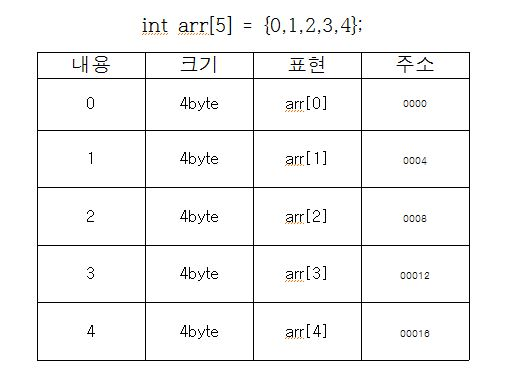

## 개요
1. 일자 : 2019. 03. 11 (월) 12:00 ~ 15:00
2. 장소 : 신촌 르호봇

## 컴퓨터 구조에 대하여

- SW
	- 응용 SW
	- 시스템 SW
- HW
	- CPU
	- RAM
	- HDD

## 메모리 구조에 대하여

[여기 꼭 읽어보세요!!!](https://genesis8.tistory.com/181) -> 보고 이해 안 되면, 밑에꺼 읽어보면 돼요!!

## 포인터

아주아주 쉽게 얘기 해볼게요. 

철수가 영희네 집을 찾아가려합니다. 영희네 집을 찾아가려면 그 집주소를 알아야겠죠? 그 집주소를 메모지에 적어둡니다. 그 후로는 언제든지 영희네 집을 찾아가서 같이 놀 수 있겠죠!

 포인터도 같은 맥락입니다. 

다른 영역에 있는 변수의 값을 바꾸려고 합니다. 다른 영역의 변수를 바꾸려면 해당 변수의 주소를 알아야겠죠? 변수의 주소를 알아내고 포인터변수에 담아둔다면, 그 후로는 언제든지 그 변수를 찾아가서 값을 바꿀 수가 있게됩니다.

자 이제 지역변수는 뭐며, 주소는 뭐고, 포인터는 어떻게 쓰는지! 하나씩 배워가면서 무슨 얘긴지 알아봅시다. 

## 포인터 사용법, 포인터 또한 단순한 변수다.

이제 포인터 얘기를 해보도록 하죠. 포인터! 포인터하면 뭐가 딱 떠오르시나요?. 아무생각이 안드신다구요..? 이제 저랑 함께 생각을 채워봅시다.

포인터도 단순한 변수입니다. 우리가 주로 접했던 integer 타입, float 타입 double 타입 등등과 마찬가지로 포인터또한 하나의 변수입니다. 이는 주소를 담는 변수라고들 하지요.  포인터와 관련된 연산자가 있습니다.

연산자| 내용 | 예제 
 ---|---|--- 
 & |object의 주소를 호출| &n;
 * | 피연산자가 가리키는 object를 간접접근 | *n = 5;


tip. object의 주소는 object가 차지하는 저장소 공간의 주소중 가장 낮은 주소를 의미한다.


## 메모리 주소

 주소라하면, 메모리의 주소를 말합니다. 우리가 프로그램을 실행시키면 그 프로그램에 사용되는 데이터들 (int x, int y 이런것들..)이 주기억장치 어딘가에 적재 됩니다. 그러한 주소를 프로그램 단위로 관리하게 되는데, C에서는 크게 네가지의로 변수들의 영역을 분류(Storage Classes)한 후에 실제 메모리에 상주시킵니다.

 이때 분류된 영역에 따라 변수들의 생애주기(Scope)가 결정됩니다. 생애주기는 크게 File Scope, Block Scope로 분류가 되는데, 변수들이 한 파일내에서 존재하는지, 아니면 한 블럭내에서 존재하는지를 나타냅니다.

## 변수의 생애주기

```C++
int i;
// static storage duration
// file scope
// external linkage

static int s;
// static storage duration
// file socpe
// internal linkage

void f() {
	int j;
	// automatic storage duration
	// block scope
	// no linkeage

	static int k;
	// static storage duration
	// block scope
	// no linkage
}
```

## OS단의 메모리 관리 체계


 우리는 이러한 영역으로 관리되는 변수들의 주소를 가지고서 요리를 하는 거죠. extern은 전역, static은 정적, automatic는 동적 그리고 resister 영역을 관리합니다. 이렇게 분류된 Storage Classes를 실제 메모리에 상주 시키는 겁니다.  아래 처럼 말이죠.


1. 텍스트 영역
	- 작성한 코드가 기계어로 변환되는 영역, EIP는 해당 코드의 흐름을 읽는 레지스트리
	- 가장 낮은 주소
2. 데이터 영역
	- 초기화 된 전역, 정적 변수가 저장되는 공간
	- bss영역과 하나로 보는 경우가 많음
	- 텍스트 영역보다 높은 주소
3. bss영역
	- 초기화 되지 않은 전역, 정적변수가 저장되는 공간
	- 데이터 영역과 하나로 보는 경우가 많음
	- 데이터 영역보다 높은 주소
4. 힙 && 스택
	- 힙 : 자유영역으로서 주소가 점점 커짐, 동적으로 할당된 메모리가 저장되는 공간
	- 스택 : 예외적으로 높은영역에서 낮은영역으로 주소가 할당되는 공간, 지역변수가 저장됨

## Q. 그래, 변수는 메모리 어딘가에 위치한다는건 알겠어요. 그래서요?

포인터는 그 주소를 담는겁니다! ' int x; 라는 변수는 automatic class의 stack 영역에 담겨지겠구나. 그럼 그 주소는 0004A 이니까 int* xp; 라는 변수에 담아놔야겠다. ' 라는게 되죠. 쉽게 풀이하면 다른 영역에 있는 주소를 알아내고 그 영역의 변수에 접근할 수 있다는 의미가 됩니다! 예제를 하나 볼게요.

유명한 SWAP 예제입니다.

```C
#include <stdio.h>
 
void swap(int x, int y);
void ptrSwap(int* x, int* y);
 
int main(void) {
    int x, y;
 
    x = 10; y = 15;
 
    printf("swap 변경전 : %d %d \n", x, y);
 
    swap(x, y);
    printf("swap 변경후 : %d %d \n", x, y);
 
    ptrSwap(&x, &y);
    printf("ptrSwap 변경후 : %d %d\n", x, y);
 
    return 0;
}
 
void swap(int x, int y){
    int tmp;
    tmp = x;
    x = y;
    y = tmp;
}
 
void ptrSwap(int* x, int* y){
    int tmp;
    tmp = *x;
    *x = *y;
    *y = tmp;
}
```

## 배열

앞서 우리는 포인터가 무엇인지, 메모리구조와 주소는 무엇인지, 결론적으로 포인터와 메모리와 주소의 상관관계를 알아봤습니다. 주소를 이용하는 또 다른 변수를 하나 소개해보고자 합니다.


이름 하여 배열!!! 읭 ? 포인터 얘기하다 뭔..

```C
int arr[10] ... ?
array.. ?
```

네 그 배열입니다.


질문 한번 해볼까요? 배열이 뭐라고 생각하시나요? 

배열은 특정 타입의 Object가 연속되어 할당된 것 입니다.


?? 얘가 무슨 소리를 하나..

그림하나 보겠습니다.



int arr[5]를 선었했을시에 구성되는 내용입니다. (int를 4byte라고 가정시)

주소 부분을 잘 보시면, 4씩 증가하고있습니다.

이는 데이터 타입의 크기 * 배열의 갯수 만큼 크기의 공간이 할당되었고,  그공간을 데이터 타입의 크기별로 쪼개어, 하나의 배열처럼 사용하는 것 입니다.

조금 더 풀어서 설명드리자면, int arr[5]를 선언하면 메모리 구조에는 20byte만큼 할당이 되고 그공간을 4byte씩 끊어서 arr[0] arr[1] arr[2] arr[3] arr[4]로 프로그래머가 알아볼 수 있게 해당 공간에 이름을 지어 그것을 배열이라고 부른답니다.

그렇다면! 그 말은 결국 주소를 요물딱조물딱 하게된다면, 배열을 표현 할 수 있지않을까요?

다음 그림 보시죠.  


자자, 그렇다면 이제 본론에 들어가겠습니다.

포인터는 주소를 담는 변수라고 했지요?

배열은 Object를 연속으로 할당하는것 이라고 했지요?

각 Object들은 주소를 가지고 있습니다.

그럼 포인터에 배열의 가장 낮은 주소를 담는다면?


int* parr = arr; 선언과 동시에 위에서 선언한 arr[5]의 가장 낮은 주소(arr)를 주었더니 parr을 배열과 같이 사용을 하게끔 되었습니다!! 와!! 신기하다!! 재밌다!! 신난다!!

그럼 마지막으로 예제만 딱 하나 더 보고 끝내겠습니다.

```C
#include <stdio.h>
 
int getlength(char * parr){
    int length = 0;
 
    while (*parr++)
        length++;
 
    return length;
}
 
int main(void) {
 
    char arr[] = "abdsaf";
    printf("%d", getlength(arr));
 
    return 0;
}
```
