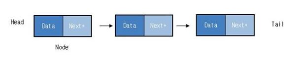

## 개요
1. 일자 : 2019. 04. 01 (월) 12:00 ~ 15:00
2. 장소 : 신촌 르호봇
3. 내용 : 링크드리스트 개념 및 구현

## 링크드리스트

List란 자료의 나열인데, ArrayList와 LinkedList로 구분되어진다. 배열리스트의(ArrayList) 경우 데이터 선언시에 크기와 타입을 알아야한다는 단점이 있으나 구현 하기가 쉽다.
연결리스트의(LinkedList) 경우는 구현이 어렵지만 데이터의 동적할당이 가능해지므로서 프로그램이 구동되면서 메모리누수가 발생하지 않는다.

연결리스트의 구성은 값을 저장하는 Data 부분과 다음 노드의 위치인 Next* 부분으로 구성된다.



## 특징
1. 데이터 크기를 몰라도 사용할 수 있다.(동적 할당)
2. 데이터누수가 발생하지 않는다.
3. 삽입,삭제,추가연산이 용이하다.
4. 느리다!시간복잡도는 O(n)

## 소스
```cpp
#include <stdio.h> 
#include <stdlib.h>

struct Node
{
	int data;
	Node* next;
};

Node* head;
Node* tail;

Node* create(int data)
{
	Node* node = (Node *)malloc(sizeof(Node));
	node->data = data;
	node->next = NULL;

	return node;
}

void add(Node* newNode)
{
	tail->next = newNode;
	tail = newNode;                                                                                                                                            	tail = newNode;
}


void add(int data)
{
	Node* newNode = create(data);
	tail->next = newNode;
	tail = newNode;                                                                                                                                            	tail = newNode;
}

Node* get(int index)
{
	Node *runner = head;

	for (int i = 0; i < index - 1; i++)
	{
		runner = runner->next;
	}

	return runner;
}


void insert(int index, Node* newNode)
{
	Node* tmp = get(index);
	Node* next = tmp->next;
	tmp->next = newNode;
	newNode->next = next;
}

void deleteNode(int index)
{
}

int getValue(int index)
{
	return 0;
}

void init(int data)
{
	head = create(data);
	tail = head;
	head->next = tail;
}

void printList()
{
	Node* runner = head;

	for(; runner != NULL; runner = runner->next)
	{
		printf("%3d ", runner->data);
	}
}

int main ()
{
	init(10);
	add(create(20));
	add(create(30));
	add(create(40));
	add(create(50));
	add(create(60));
	add(create(70));
	insert(2, create(1000));

	printList();


	system("pause");
	
	return 0;
}
```